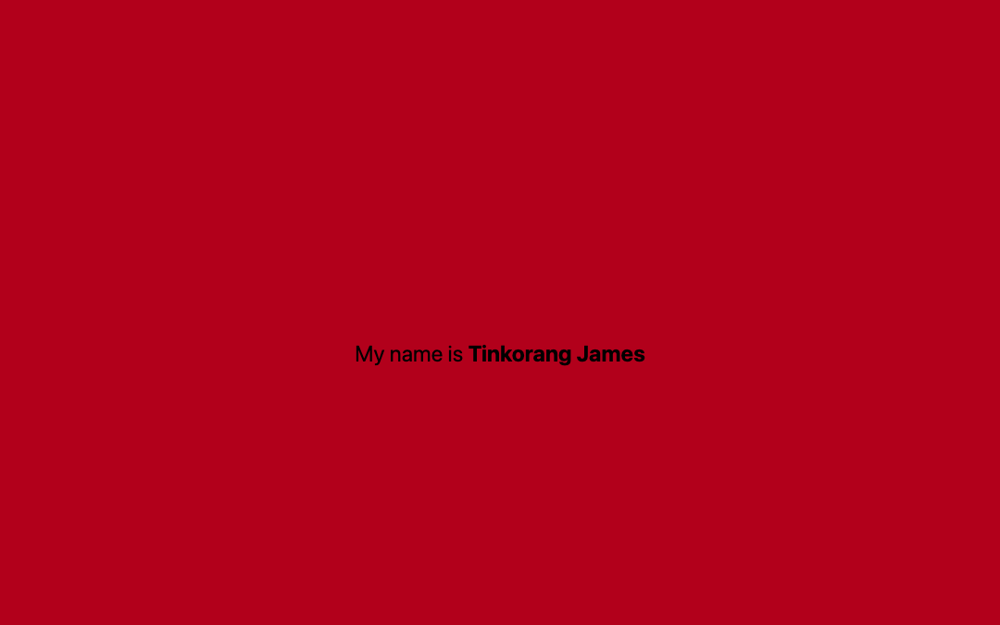

# Task Management App

This is a simple task management app built using React Native with Expo CLI. The app features a header, a search bar, categories, and ongoing tasks.

## Components

### Header
- **File:** `components/Header.js`
- **Description:** 
  Displays a greeting message, the count of tasks for the day, and a profile image.

### SearchBar
- **File:** `components/SearchBar.js`
- **Description:** 
  Provides a search input for the user to search tasks. Includes a filter button.

### Categories
- **File:** `components/Categories.js`
- **Description:** 
  Displays a horizontal list of task categories with their respective task counts and images.

### OngoingTasks
- **File:** `components/OngoingTasks.js`
- **Description:** 
  Displays a vertical list of ongoing tasks.

## Screenshots

## Student Information

- **ID Number:** 11204710
